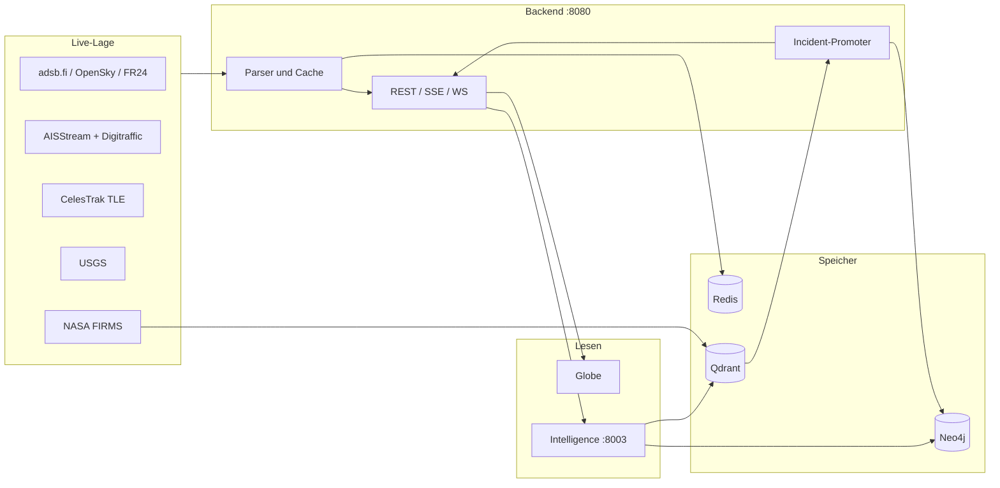

# Herz_und_Nieren_2026_Alpha

Prüfbericht, nur Lesen und Ausführen. Keine Fixes in diesem Lauf.

| | |
|---|---|
| Stand | `b619ad7` auf `fix/live-feed-parser-resilience` (2026-09-27) |
| Art | Kantenprüfung der OSINT-Module, mit ausgeführten Proben |
| Live-Stichprobe | Digitraffic AIS `locations`, Stand `2026-09-27T00:52:49Z`, 963 Features |

## Ergebnis in einem Satz

Die Live-Feeds schlucken einzelne kaputte Datensätze inzwischen, ohne die ganze Quelle zu verwerfen. Die schweren Treffer sitzen dort, wo zwei Module dieselbe Koordinate unterschiedlich lesen, wo Sentinel-Werte als echte Messung durchgehen, und wo ein Filter syntaktisch an der falschen Stelle steht.

## Lagebild

Graft (`@nanonets/graft` 0.16.0 ist lokal installiert) wurde nicht initialisiert. `graft init` und `graft build` schreiben Agent-Wiring und `.gitignore`. Das wäre eine Repo-Änderung und kein Test. Archify bleibt bei diesem Bericht ein Mermaid-Lagebild. Ein Showcase-HTML hätte die Befunde nicht schärfer gemacht.

## Wie geprüft wurde

Proben liefen in den Service-Umgebungen (`uv run python`) gegen den importierten Code, plus ein öffentlicher GET auf die Digitraffic-Locations. Nicht gelaufen: die kompletten Pytest-Suiten, der Browser, ein Neo4j mit echten Events, die übrigen Upstream-APIs. Wo eine Aussage nur aus der Cypher-Semantik folgt, steht das am Befund.

## Geschlossen auf diesem Branch

Diese früher offenen Kanten sind im aktuellen Code zu, und eine Probe hat das bestätigt:

- `alt_baro == "ground"` wird vor der Fuß-Umrechnung erkannt. Ein Bodenflugzeug wirft adsb.fi nicht mehr als ganze Quelle ab.
- Ein leerer `vessels:all`-Cache ist ein Miss. Digitraffic bleibt erreichbar. `timestampExternal` der Live-API ist Millisekunden (13 Stellen, Alter der Stichprobe 39 s). Die Millisekunden-Annahme stimmt.
- `ISS` ist ein ganzes Wort. `SWISSCUBE` und `MISSION` werden nicht zur ISS. `USA-293` und `USA 293` bleiben US.
- Ein kaputtes USGS-Feature fällt aus der Liste, die Nachbarn bleiben.
- Ein leerer Hotspot-Cache fällt auf `DEFAULT_HOTSPOTS` zurück. Eine kaputte Zeile wird übersprungen.
- Incident-Ordinals sind Epoch-Millisekunden, ohne Modulo `2_000_000_000`.
- Die aktive CelesTrak-Gruppe wird nicht mehr nach 500 Satelliten abgeschnitten.
- Timeline-BBox über dem Antimeridian wird in zwei Längengrade-Spannen zerlegt (`compile_legacy_bbox_filter`).

## Offene Befunde

Schwere: kritisch, hoch, mittel, niedrig.

### F-01 — kritisch — FIRMS-Promoter vertauscht Breite und Länge

Die Karte und der Collector bauen die FIRMS-URL als `@Länge,Breite`. Der Promoter liest die erste Zahl als Breite.

Produzenten:

- `services/backend/app/routers/firms.py`, `_build_map_url`
- `services/data-ingestion/feeds/firms_collector.py`, die `row["url"]` für das Signal

Leser:

- `services/backend/app/services/incident_promoter/detectors/firms.py`, `_COORD_RE` benennt die erste Zahl `lat`

Probe: Punkt 48.1 N, 37.8 E (Donezk-Umgebung) wird zur URL

`https://firms.modaps.eosdis.nasa.gov/map/#d:2026-04-11;@37.8000,48.1000,10z`

`_parse_firms_coords` liefert `(37.8, 48.1)`. Das ist etwa 37.8 N, 48.1 E, nordwestliches Kaspisches Meer, nicht die Ukraine. Der Cluster-Schlüssel wandert mit. Die Globus-Punkte selbst bleiben richtig, weil `FIRMSLayer` die Felder `latitude` und `longitude` zeichnet und nicht die URL. `IncidentCreateRequest` lehnt eine Breite außerhalb ±90 ab. Eine vertauschte Länge über 90, also Ostasien, Australien und der größte Teil Amerikas, öffnet keinen Incident. Der Detektor setzt `ignited` schon beim Erzeugen des Hits, vor dem Persistieren. Ein abgelehnter Create lässt den Bucket gezündet.

Der Test `test_parse_firms_coords_happy` baut die URL als `@Breite,Länge` und bleibt damit grün, während die Produktions-URL andersherum steht. Die Suite verriegelt den Fehler.

### F-02 — hoch — AIS-Sentinel werden als Fahrt und Kurs gezeichnet

Digitraffic-Stichprobe `2026-09-27T00:52:49Z`, 963 Positionen:

- 90 Positionen mit `cog >= 360` (360 bedeutet im AIS „Kurs nicht verfügbar“)
- 9 Positionen mit `sog == 102.3` (AIS-Sentinel „Fahrt nicht verfügbar“)

`_parse_digitraffic_feature` behält sie. Eine Live-Zeile kam als `(mmsi 305238000, speed_knots 102.3, course 360.0)` zurück. Diese Schiffe laufen auf dem Globus mit Geisterfahrt und Kurs 360. Heading 511 (nicht verfügbar, 131 Zeilen) wird nicht gelesen. Der Schaden sitzt auf `cog` und `sog`.

### F-03 — hoch — Geo-Event-Filter filtert nicht

`GET /api/graph/events/geo?codebook_type=military` hängt `WHERE ev.codebook_type STARTS WITH $codebook_type` an ein `OPTIONAL MATCH` (`services/backend/app/routers/graph.py`). In Cypher gehört dieses `WHERE` zum optionalen Muster. Ein Fehlschlag setzt den Ort auf null und lässt das Event in der Zeile. `ORDER BY timestamp DESC LIMIT` läuft über alle Events. Militärische Events außerhalb des globalen Zeitfensters fehlen, fremde Events belegen das Limit. Die vorhandene Router-Prüfung kontrolliert nur, dass der Parameter gebunden wird.

Nicht gegen eine laufende Neo4j ausgeführt. Die Klausel-Reihenfolge ist im Quelltext eindeutig.

Dieselbe Funktion wirft `ValueError`, sobald `lat` kein Float ist (`float(r["lat"])` in der Listenkomprehension, ohne Schutz). Eine schlechte Location macht die ganze Route zu HTTP 500. Dieselbe Ausdrucksform ist mit `"not-a-number"` ausgeführt worden und bricht ab. Breite 0 bleibt erhalten.

### F-04 — hoch — Vision-Pfadprüfung ist ein Präfix, der Intelligence-Einstieg prüft die URL nicht

`services/intelligence/agents/tools/vision.py`: `validate_image_url` akzeptiert jeden HTTPS-URL und jeden lokalen Pfad, der mit einem Eintrag aus `vision_allowed_local_paths` beginnt (Default `/tmp/odin/images/`). `Path.read_bytes` löst `..` auf und hält den Pfad nicht unter dem Verzeichnis.

Ausgeführt: der String `/tmp/odin/images/../../outside.png` besteht `validate_image_url` und `Path.resolve()` verlässt `/tmp/odin/images/`.

`services/intelligence/main.py`, `QueryRequest.image_url`, hat keinen Host- und keinen Pfad-Validator. Der Backend-Typ `IntelQuery` ist strenger (nur `http`/`https`, literale private und Link-Local-Adressen weg). Wer den Intelligence-Port direkt aufruft, umgeht diese Schicht.

Auf diesem Python gilt `169.254.169.254` als `is_private`. Der Downloader blockt Link-Local, Loopback und die üblichen RFC-1918-Netze. Offen bleibt `100.64.0.0/10` (CGNAT): `is_private` ist falsch, `_is_private_ip("100.64.0.1")` ist falsch. Der Backend-Validator lässt dieselbe literale Adresse durch, weil er dieselbe Flagge benutzt. Hostnamen, die keine IP-Literale sind, akzeptiert das Backend ohne DNS-Auflösung. Danach entscheidet nur der Downloader, und der prüft die aufgelöste Adresse einmal und holt danach wieder über den Hostnamen.

### F-05 — mittel — Hotspot-Kanten verfälschen Lage und Stufe

Ausgeführt an `_normalize_hotspot` und `_hotspots_from_rows`:

- `name`, `region` und `description` mit JSON `null` werden zu den Zeichenketten `"None"`. Die Identität gilt als vollständig, der Punkt bleibt in der Liste.
- Threat `LOW` und ein fehlender Threat werden `MODERATE`. Die Stufe wird angehoben.
- Eine nicht-leere Cache-Liste ersetzt `DEFAULT_HOTSPOTS` komplett. Ein einzelner gültiger Cache-Eintrag blendet die kuratierte Karte aus. Der leere Cache ist bereits korrigiert.

Datenkante, ohne Codepfad-Bruch: der Default „Taiwan Strait“ liegt auf 24.0 N, 121.0 E. Das ist die Insel, die Straße liegt westlich davon um 119–120 E.

### F-06 — mittel — Satelliten-Kategorien an Token-Kanten

Ausgeführt an `_detect_country`, `_categorize`, `_detect_type`, `_parse_tle_text`:

| Name | Ergebnis | Kante |
|---|---|---|
| `AGPS-1` | Kategorie `gps` | `GPS` ist ein Teilstring, kein Token |
| `USES-1` | Typ `comms` | `SES` steckt in `USES` |
| `QZSS` | Land fehlt | Präfix `QZS` verlangt, dass das nächste Zeichen kein Buchstabe ist. `QZS-1` wird JP |
| `DSP F1` | Typ `recon` | Militär ohne Recon-Präfix fällt auf `recon` |
| Gruppen-Text mit `not updated` und gültigen TLE-Zeilen | ganze Gruppe verworfen | `_celestrak_text_unusable` |

Ein normaler ISS-TLE (NORAD 25544) parst. Land INT, Kategorie `station`, Periode 92.89 min. `SWISSCUBE` bleibt leer. Die 500er-Kappe auf `active` ist weg.

### F-07 — mittel — OpenSky füllt Lücken mit Norden und 1970

`_parse_opensky_state`: fehlender Kurs (`state[10] is None`) wird 0 Grad. Fehlender Kontakt (`state[4] or 0`) wird `1970-01-01T00:00:00+00:00`. Die Probe hat beides auf einem State-Vektor gesehen. `alt_baro: "Ground"` (großes G) verwirft nur dieses Flugzeug. `alt_baro: null` oder ein fehlendes `alt_baro` bleibt in der Luft auf 0 m, auch wenn `alt_geom` 35000 Fuß trägt. Das geometrische Feld wird nicht gelesen. FR24 setzt `vertical_rate` fest auf 0, und Boden ist nur die Zeichenkette `"ground"` im Höhenfeld. Der exakte Sentinel `"ground"` ist in Ordnung, inklusive Militärmarkierung über `RCH123`.

### F-08 — mittel — Kabel: boolsche Zeichenketten und NaN

Ausgeführt an `_parse_cables` und `_parse_landing_points`:

- `is_planned: "false"` und `"0"` werden `True`, weil `bool` einer nicht-leeren Zeichenkette wahr ist.
- `owners` als Liste wirft das ganze Kabel weg (`cable_feature_skipped`), statt die Besitzer zu verwerfen.
- `capacity: "12 Gbps"` und `length: "500 nmi"` werden still `None`.
- Ein Landepunkt mit Breite `NaN` wird angenommen. Pydantic lässt den Wert durch.

### F-09 — mittel — Cache-Treffer von FIRMS, EONET und GDACS sind nicht zeilenfest

Der Live-Pfad überspringt einen kaputten Qdrant-Punkt. Der Cache-Pfad macht `Model(**row)` über die ganze Liste (`routers/firms.py`, `eonet.py`, `gdacs.py`). Eine Zeile ohne Pflichtfeld ist ein `ValidationError` und damit HTTP 500 für die gesamte Route, für die TTL des Cache (60 s bzw. 120 s). Mit einem absichtlich unvollständigen Dict ausgeführt.

### F-10 — mittel — Graph-Intent und LIMIT-Injektion an Teilwörtern

Ausgeführt:

| Frage | Gewähltes Template |
|---|---|
| `What resources does "Wagner Group" control?` | `source_backed` (`source` steckt in `resources`) |
| `Who does "Wagner Group" cooperate with?` | `one_hop` (`operate` steckt in `cooperate`) |
| `Show events involving the 5th fleet` | `event_timeline`, Ort ist der ganze Satz (`events in` ist Präfix von `events involving`, und ohne Anführungszeichen gibt es keine Entität) |
| `events in Black Sea` | `event_timeline`, Ort `Black Sea` |

`inject_limit` sucht `\bLIMIT\b` im Rohtext. Eine Abfrage mit `CONTAINS 'NO LIMIT'` und eine mit Kommentar `// LIMIT not really` bekommen kein angehängtes `LIMIT 100`. Eine schlichte `MATCH … RETURN` schon. Das bleibt lesend. Die Obergrenze fehlt, sobald das Wort irgendwo vorkommt. Template-Parameter `limit` hat nach dem Merge mit den Defaults keine Obergrenze.

`operates` und `procures` landen bewusst auf `one_hop`. Das ist durch Tests festgehalten und hier kein neuer Defekt, analytisch aber ein Nachbar-Dump statt der Kante `OPERATES` oder `PROCURES`.

### F-11 — mittel — Admin-Token: Leerzeichen blockt den Fallback

`require_admin_token` strippt. Die Almanac- und Report-Routen wählen das Token mit `reports_admin_token or incidents_admin_token`, vor dem Strip. Ein Reports-Token aus Leerzeichen ist in Python wahr, wird danach leer, und die Route antwortet 503, obwohl das Incident-Token gesetzt ist.

### F-12 — mittel — Vision-Consumer schaltet die Schema-Prüfung nach einem Netzwerkfehler dauerhaft aus

`services/vision-enrichment/consumer.py`, `_validate_qdrant_schema`: bei einer beliebigen Exception außer `QdrantSchemaMismatch` wird `_qdrant_schema_validated = True`. Ein einmaliger Timeout unterdrückt die Schema-Prüfung für die Lebensdauer des Prozesses. `analyze_image` liest `image_path` ohne Wurzelbindung.

### F-13 — niedrig — RSS: ein Eintrag mit ungeformtem `content` bricht den Rest des Feeds ab

`feeds/rss_collector.py`: `entry["content"][0].get(...)` steht außerhalb des Per-Item-`try`. Eine erste Content-Zelle, die kein Mapping ist, fliegt bis zum Feed-`except` in `collect`. Die folgenden Einträge desselben Feeds fallen aus. Leere Liste ist falsy und damit ungefährlich.

### F-14 — niedrig — FIRMS-Fenster sind Konfliktboxen, der Name `russia` deckt Russland nicht

`FIRMS_BBOXES["russia"]` ist `30,50,60,70` (West 30, Süd 50, Ost 60, Nord 70). Fernost, die Krim südlich von 44 N außerhalb der Ukraine-Box, und alles östlich von 60 E fehlen. Die Boxnamen sind keine Länder. Das Land kommt aus dem Spatial Catalog, wenn die Normalisierung trifft. Die Abdeckung bleibt lückenhaft, und ein Analyst, der „FIRMS weltweit“ liest, sieht diese Lücken nicht.

Explosions-Flagge: der Collector leitet bewusst keine ab (VIIRS I4 sättigt nahe 367 K). `frpToColor` deckelt die Farbe bei FRP 100. Das ist dokumentiertes Verhalten, kein stiller Schwellen-Bug.

## Modulmatrix

Prüftiefe: **Probe** (importiert und mit Kantenwerten ausgeführt), **Gelesen** (Kanten im Quelltext nachgezogen), **Inventar** (Modul existiert, in diesem Lauf nicht bis zur Kante).

### Backend, Live-Lage

| Modul | Tiefe | Kante |
|---|---|---|
| `flight_service` + `/flights` | Probe | Boden-Sentinel, `NaN`, `Ground`, OpenSky-Nullen. F-07 |
| `vessel_service` + `/vessels` | Probe + Live-API | Cache-Miss, 0/0 verworfen, Zeitstempel ms bestätigt, AIS-Sentinel F-02 |
| `satellite_service` + `/satellites` | Probe | Token, TLE, `not updated`. F-06 |
| `earthquake_service` | Probe | Ein schlechtes Feature fällt, Tsunami `"0"`/`"1"` |
| `cable_service` | Probe | F-08 |
| `hotspots` | Probe | F-05 |
| `firms` / `eonet` / `gdacs` Router | Probe | Cache-Unpack F-09. FIRMS-URL F-01 |
| `aircraft` Tracks, `feed_health`, `cables` Router | Gelesen | dünne Hüllen um die Services |
| `ws/flight_ws`, `ws/vessel_ws` | Gelesen | Fehler werden als WS-Error-Frame gesendet, die Schleife läuft weiter |

### Backend, Lage und Wissen

| Modul | Tiefe | Kante |
|---|---|---|
| `graph` Router | Gelesen + Ausdrucksprobe | F-03. Nachbarschafts-Cypher ist parametergebunden |
| `timeline` + `spatial_filters` | Gelesen | Antimeridian-Split, ISO-Fenster, Süd>Nord → 422 |
| `spatial` Router | Gelesen | Asset-Pfad läuft durch denselben Validator, Range-Suffix und `end < start` → 416 |
| `incidents` + `incident_store` | Gelesen | Ordinal ohne Wrap. F-33, F-34, F-35 |
| `incident_promoter` / Telegram | Gelesen | F-32 |
| `incident_promoter` / FIRMS-Detektor | Probe | F-01. Andere Detektoren Inventar |
| `almanac`, `reports`, `admin_auth` | Gelesen | F-11 |
| `intel` Router, `rag`, `signals`, `landing`, `recon` | Inventar | Intel-URL-Validator am Backend-Modell ist die strenge Schicht vor F-04 |
| `severity`, `_loc_key`, `briefing`, `country_almanac` | Inventar | |
| `signal_stream`, `intel_stream` | Inventar | |

### Intelligence

| Modul | Tiefe | Kante |
|---|---|---|
| `graph_query._match_intent`, `inject_limit` | Probe | F-10 |
| `read_queries.validate_cypher_readonly` | Probe | F-15. Nacktes `DETACH DELETE` bleibt abgelehnt. `GRANT`/`RENAME`/`ALTER` stehen nicht in der Liste. Die Session läuft bei Tool-Abfragen mit `read_only=True` |
| `react_agent` + `workflow` Agent-Knoten | Gelesen | F-17 |
| Synthesis- und Analyst-Parser | Probe | F-16 |
| `rag/corpus_policy`, `content_quality`, `qdrant_search` | Probe | F-18 |
| `rag/chunker` | Gelesen | F-19 |
| `graph/client.py` | Gelesen | `READ_ACCESS` nur wenn `read_only` gesetzt ist. Der Tool-Pfad setzt es |
| `vision.py`, `main.QueryRequest` | Probe | F-04 |
| `graph_templates` Schreibpfad | Gelesen | Templates, keine String-Interpolation der Parameter in den Cypher-Text |
| ReAct, Synthesis, RAG, Codebook, Spatial | Inventar | |

### Data-Ingestion

| Modul | Tiefe | Kante |
|---|---|---|
| `feeds/firms_collector` | Gelesen | URL-Reihenfolge F-01, Boxen F-14, eine schlechte CSV-Zeile wird übersprungen |
| `feeds/rss_collector` | Gelesen | F-13 |
| `feeds/usgs_collector` | Gelesen | F-20. Getrennt vom Backend-Live-Parser |
| `feeds/ucdp_collector`, `feeds/eonet_collector` | Gelesen | F-21 |
| `feeds/military_aircraft_collector` | Gelesen | F-22 |
| `tle_updater`, `hotspot_updater`, `hapi`, `gdacs`, `nlm` write, `loc_key` | Zweite Runde | siehe die unnummerierte Liste unter dem Nachtrag |
| `gdelt_raw/*`, `graph_integrity/*`, `nlm_ingest/*`, `spatial_catalog/*`, `suv_structured/*` | Inventar | NLM-Write-Pfad: keine `f"MATCH"`/`f"MERGE"`-Treffer in `nlm_ingest` |

### Frontend

| Modul | Tiefe | Kante |
|---|---|---|
| `FIRMSLayer`, `lod.ts` | Gelesen | Punkte nutzen Lat/Lon-Felder, also nicht F-01. `inViewBounds` kennt `west > east`. Die Flugspuren nutzen das nicht. F-27 |
| `useFlights`, `useVessels` | Gelesen | Laufende Nummer verwirft eine ältere Antwort |
| `useEarthquakes`, `useSatellites`, `useFIRMSHotspots`, `useAircraftTracks` | Gelesen | F-29 |
| `milTrackAdapter`, `EventLayer`, `ScrubberMount` | Gelesen | F-23, F-24, F-25 |
| `EntityClickHandler`, `resolveWorldviewPick`, `SatelliteLayer`, `FlightLayer` | Gelesen | F-26, F-28 |
| `aircraftIcons`, `WorldviewPage`, `EventCallout`, `useSignalFeed`, `navigation.ts` | Gelesen | F-30, F-31 |
| `spatial/geometry.ts`, `containment.ts` | Gelesen | Welt-Scope ist absichtlich überall `inside`. Ringe werden vor dem Point-in-Polygon abgewickelt |
| `referenceData.ts` | Gelesen | Koordinaten endlich und im Bereich, sonst wirft der Decoder |
| `websocket.ts` | Gelesen | Klasse wird von keinem Hook benutzt. Die UI pollt |
| Übrige Layer, Spotlight, War Room, Spatial-UI | Inventar | Kein Browserlauf |

### Vision-Enrichment

| Modul | Tiefe | Kante |
|---|---|---|
| `consumer.py`, `vision.py` | Gelesen | F-12 |

## Nachtrag, zweite Runde

Dieselben Module, nach der ersten Niederschrift noch einmal an den Kanten ausgeführt. Die Proben unten sind in dieser Runde selbst gelaufen, außer wo eine Zeile nur aus dem Quelltext folgt.

### F-15 — hoch — Der Read-only-Wächter schluckt Schreibworte, die zwischen Anführungszeichen in einem Kommentar stehen

`validate_cypher_readonly` lehnt `;` vor dem Entfernen von Strings ab und ersetzt danach jedes Paar `'…'` oder `"…"`. Ein Kommentar, der ein Anführungszeichen öffnet und ein späteres schließt, gilt der Prüfung als String. Ausgeführt, Rückgabe jeweils `True`:

- `/* ' */ MATCH (n) DETACH DELETE n /* ' */`
- `/* ' */ LOAD CSV FROM 'http://127.0.0.1/x.csv' AS row RETURN row /* ' */`
- `/* ' */ CALL apoc.load.json(...) YIELD value RETURN value /* ' */`
- ein Zeilenkommentar `// '` um ein `MERGE`

Ein nacktes `DETACH DELETE` bleibt `False`. Ein Semikolon in einem echten String (`name = 'a;b'`) wird ebenfalls abgelehnt, weil `;` vor dem Strip geprüft wird.

Der Tool-Pfad schickt angenommene Abfragen mit `read_only=True`. Eine echte Schreibklausel scheitert damit an der Neo4j-Session, sofern die Session den Modus erzwingt. `LOAD CSV` und `CALL` sind genau die Muster, die der Wächter zusätzlich verbieten will und die ein Lese-Modus nicht ersetzt. Neo4j wurde nicht ausgeführt.

### F-16 — hoch — Threat und Confidence lesen Teilwörter

Dieselbe Schleife steht in `graph/workflow.py` (Synthesis) und `graph/nodes.py` (Analyst für die Stufe, Synthesis für die Confidence). Die Stufe nimmt das erste von `CRITICAL`, `HIGH`, `ELEVATED`, das irgendwo im Großtext vorkommt. Ausgeführt:

| Text | Stufe | Confidence |
|---|---|---|
| `Threat Assessment: MODERATE. Supplies move by highway.` | `HIGH` (`HIGH` in `HIGHWAY`) | 0.5 |
| `Threat Assessment: MODERATE (not critical).` | `CRITICAL` | 0.5 |
| `The highlight is logistical.` | `HIGH` (`HIGH` in `HIGHLIGHT`) | 0.5 |
| `low confidence … not high confidence.` | `HIGH` | 0.8 (`high confidence` wird vor `low confidence` geprüft) |

### F-17 — hoch — Die ReAct-Grenze verwirft die Aufrufe, die sie gerade gezählt hat

`react_agent_node` addiert `tool_calls_count` und schreibt `tool_trace`, bevor die Kante `should_continue` läuft. `guard_check` stoppt bei `count >= 8` oder `iteration >= 5` und `should_continue` geht dann nach `synthesis`. Die Aufrufe dieses Turns stehen in der Spur und werden nicht ausgeführt. Default aus `config.py`: 8 Aufrufe, 5 Iterationen. Der LLM-Knoten wurde nicht aufgerufen. Die Reihenfolge steht im Quelltext.

### F-18 — mittel — NaN sortiert den besten Treffer nach hinten, ein schlechter Treffer bricht die ganze Suche ab

`sorted([0.12, nan, 0.92], reverse=True)` liefert `[0.12, nan, 0.92]`. `apply_tier_boost` sortiert `tier_score` so. Ein nicht-endlicher Score stellt den stärksten Treffer an das Ende.

`content_junk_reason` erwartet einen String. Eine Liste als `content` wirft `AttributeError: 'list' object has no attribute 'strip'`. `qdrant_search` fängt das um die ganze Funktion. Ein Treffer macht die Knowledge-Base-Antwort zu `Knowledge base search failed`.

### F-19 — mittel — Chunker mit Overlap ab Chunk-Größe läuft nicht aus

`chunk_text` setzt `start = end - overlap`. Der Fortschritt ist `chunk_size - overlap`. Bei `overlap >= chunk_size` bleibt `start` stehen oder läuft rückwärts. Die Default-Werte 512/50 sind unauffällig. Der Indexer nutzt die Defaults. Leerer Text mit Defaults liefert `['']`, weil `len(words) <= chunk_size` auch für null Wörter gilt.

### F-20 — hoch — USGS-Ingestion wertet fehlende Tiefe als Oberflächenexplosion, eine schlechte Zeit verwirft den Batch

`feeds/usgs_collector.py`: `float(coords[2] or 0.0)` macht `null` zu 0 km. In `concern_score` ist die Tiefenkomponente `max(0, 1 - depth/10) * 0.15`. Tiefe 0 ist der Höchstwert. Dieselbe Funktion liegt außerhalb des Geometry-`try`: `props.get("time") or 0` und danach `ts_ms / 1000`. Eine Zeit als String wirft `TypeError` und bricht `_parse_features` mit den schon gesammelten Events ab. Fehlende Zeit wird 1970. Der Backend-Live-Parser für den Globus ist davon getrennt und bleibt bei der geschlossenen Kante aus der ersten Runde.

### F-21 — hoch — UCDP verliert die Koordinate 0, EONET bricht bei `date: null` ab

`ucdp_collector._parse_event`: `float(lat_str) if lat_str else None`. Die Zahl `0` und `0.0` sind falsch und werden `None`. Der String `"0.0"` bleibt 0. Äquator und Nullmeridian fallen aus der Karte, je nachdem ob die API eine Zahl oder einen String schickt.

`eonet_collector._parse_events`: `max(..., key=lambda g: g.get("date", ""))`. Existiert der Key mit Wert `null`, liefert `get` `None`, und `max` vergleicht `None` mit `str`. `collect` fängt nur den HTTP-Fetch. Ein Event mit einem null-Datum verhindert den ganzen Lauf.

### F-22 — hoch — ICAO-Blöcke ganzer Staaten werden als eine Teilstreitkraft gelabelt

`MILITARY_ICAO_RANGES` in `feeds/military_aircraft_collector.py`:

| Label im Code | Hex | Was der Block tatsächlich ist |
|---|---|---|
| USAF | `AD0000–AFFFFF` | enthält den zivilen US-Bereich bis `ADF7C7` |
| RAF | `400000–43FFFF` | gesamte UK-Zuteilung |
| GAF | `3C0000–3EFFFF` | der größte Teil der deutschen Zuteilung |
| IAF | `738000–73BFFF` | israelische Zuteilung, nicht nur die Luftwaffe |

`identify_branch("adf7c7")` fällt in den USAF-Bereich. Dieselbe Datei benutzt für die Abdeckung dieselben engen Konfliktboxen wie FIRMS (`russia` wieder 50–70 N, 30–60 E).

### Weitere Ingestion-Kanten der zweiten Runde

Diese Punkte hat die Ingestion-Runde lokal ausgeführt. Sie sind in dieser Niederschrift nicht noch einmal nachgefahren. Sie stehen hier, damit sie nicht verloren gehen, und sie sind noch keine eigenen Befundnummern:

- HAPI: ein Document-URL für alle Länder, `events: null` wirft `int(None)` und stoppt die folgenden Länder.
- TLE-Updater: Checksumme und abweichende Katalognummer in Zeile 2 werden nicht geprüft.
- Hotspot-Updater: ein Qdrant-Fehler zählt als null Erwähnungen und senkt jede Basisstufe.
- NLM `LINK_CLAIM_ENTITY` matcht nur `name`, nicht `type`. Zwei `Mercury` hängen an derselben Kante.
- GDACS: ein unparsebares `severity.value` macht `return 0.0` statt die nächste Quelle zu lesen.
- GDELT-CAMEO: unbekannter Root wird `""` und bleibt als Event ohne Typ.
- FIRMS-Hash: `acq_time` `"930"` und `"0930"` werden dieselbe ISO-Zeit und zwei Punkt-IDs.
- `loc_key`: gerundetes −0 und +0 sind verschiedene Schlüssel und umgehen den Null-Island-Vergleich mit `== 0.0`.

## Nachtrag, Frontend

Die Formeln und Zweige unten sind in dieser Runde im Quelltext nachgezogen. Die Datumsgrenzen-Mitte und die Pol-Klemme folgen aus der Arithmetik, ohne zweiten `tsx`-Lauf.

### F-23 — hoch — Militär-Tracks schneiden die Datumsgrenze durch den Globus

`positionAtTime` interpoliert die Länge linear. Von 179° nach −179° ist die Mitte 0°. Das Icon verlässt den Bogen und steht auf dem Nullmeridian. `milTrackAdapter.ts`, die Rückgabe `a.lon + (b.lon - a.lon) * f`.

### F-24 — hoch — Gestapelte Ereignisse polwärts von 85° werden auf ±85° festgenagelt

`offsetPosition` gibt ein einzelnes Event an seinem Ort zurück. Ab zwei Events in derselben 0.12°-Zelle klemmt es die Breite auf `[-85, 85]`. Zwei Events bei 89° N landen beide auf 85° N, etwa 444 km südlich. `EventLayer.tsx`, `Math.max(-85, Math.min(85, nextLat))`.

### F-25 — hoch — Ein Schritt im Scrubber nimmt die Zahl der belegten Bins

Das Histogramm schreibt nur Bins mit Count größer 0 (`timeline.py`, Schleife über `sorted(counts)`). `ScrubberMount` setzt `bucketCount` auf `data.buckets.length`. `?? 120` greift nicht bei `0`, weil `0` kein Nullish ist. Zwei belegte Bins in 24 Stunden sind ein Schritt über die halbe Spanne. Eine leere Liste wird in `stepTargetMs` mit `Math.max(bucketCount, 1)` zur vollen Spanne.

### F-26 — hoch — Unten nicht markierte Linien schlucken den Klick

`classifyWorldviewHit` macht aus jedem gewöhnlichen Pick `operational`, sobald kein `odinKind` dransteht. `resolveWorldviewPick` nimmt den ersten operationalen Treffer und hört auf. Orbit-Bögen, Flugspuren und Kabelstriche ohne Datenfeld gewinnen vor dem Länder-Test.

### F-27 — mittel — Flugspuren verschwinden, wenn die Kamera die Datumsgrenze schneidet

`FlightLayer` verwirft eine Spur, wenn `lon < west || lon > east`. Ist `west > east`, gilt das für jede Länge. Die Icons bleiben. `inViewBounds` in `lod.ts` und die Schiffs-Schicht behandeln diesen Fall als Vereinigung der beiden Seiten.

### F-28 — mittel — Satellitenpunkte stehen auf der Uhr des letzten Effects

`SatelliteLayer` propagiert mit `new Date()` nur in dem Effect, der bei Daten, Sichtbarkeit oder Degradation läuft. Die Kamera-Bewegung schaltet nur die Bögen. Ein LEO-Punkt bleibt liegen, während der Bogen den Weg zeigt, den er fliegen sollte.

### F-29 — mittel — Ältere Polls überschreiben neuere

`useFlights` und `useVessels` haben eine laufende Nummer. `useEarthquakes`, `useFIRMSHotspots` und `useAircraftTracks` prüfen nur `cancelled` beim Unmount. Eine ältere Antwort, die später eintrifft, schreibt die neuere Lage weg. `useSatellites` bricht einen laufenden Fetch nicht ab: nach `enabled = false` leert der Effect die Liste, und `setSatellites(data)` füllt sie wieder. Dieselbe Form haben `useCables`, `useEONETEvents` und `useGDACSEvents`.

### F-30 — mittel — Callsigns und der Pin-Titel lügen

`classifyAircraft` legt `VIPER`, `RAPTOR`, `HAWK` und `COBRA` in die Transport-Präfixe, vor der Jäger-Heuristik. `VIPER11` wird `transport_mil`. Alles andere Militärische, das nicht schnell und hoch ist, wird `fighter`, inklusive `CNV123` auf 800 m.

`WorldviewPage` setzt den Event-Titel auf `codebook_type ?? id`. Der Kommentar nennt das ausdrücklich. Der Pin und der Spotlight zeigen `conflict.armed`, nicht die Schlagzeile. Die Callout-Detailroute kann den echten Titel nachladen. Schlägt `getEventDetail` fehl, lässt `EventCallout` das alte `detail` stehen und zeigt den Titel des vorherigen Events.

### F-31 — mittel — Signal-Reset und doppelter Scope

`useSignalFeed` leert beim SSE-`reset` die Dedupe-Menge und ersetzt die Liste danach mit dem Snapshot. Ein Event, das während des Refetch ankommt, fällt aus dem Snapshot und aus der Menge. Es kann später noch einmal als neu erscheinen.

`readLocationEvent` macht aus mehr als einem `scope`-Parameter die leere Zeichenkette, auch aus `?scope=country:UKR&scope=country:DEU`. Der leere Key ist ungültig, die Hydration ersetzt die URL durch die Welt.

## Nachtrag, Incident-Kern

### F-32 — hoch — Ein neuer Telegram-Centroid verdrängt sich selbst

`telegram.py` legt einen Centroid mit `last_seen_ts is None` an und ruft `_evict_if_needed` auf, bevor Zeile 193 `last_seen_ts` setzt. Die Eviction sortiert `None` als `datetime.min`. Ist `max_centroids` voll, fliegt genau der neue Key wieder hinaus. Der nächste gleiche Post legt einen neuen Centroid an und verliert ihn wieder. `telegram_min_hits` wird nie erreicht. Die alten Centroids bleiben.

### F-33 — hoch — Ein Signal-Update schreibt den alten Status zurück

`apply_signal_update` liest den Incident, kopiert ihn und schreibt den ganzen Record über `INCIDENT_UPSERT`, inklusive `status`. Silence oder Close zwischen Lesen und Schreiben wird von dem Update wieder auf `open` gesetzt. `close_incident` behandelt jeden Status außer `open` als terminal und schreibt nichts. Promote publiziert trotzdem, wenn der Store den unveränderten Record zurückgibt. Silence ruft danach weiter `mark_silenced` auf.

### F-34 — hoch — Eine kaputte Incident-Zeile legt Liste und Promoter lahm

`_row_to_incident` validiert ohne Schutz pro Zeile. `severity="medium"` ist kein erlaubter Wert, `status="archived"` ist kein `IncidentStatus`. `list_open_incidents` wirft, der Router antwortet 503 für die ganze Liste. Dieselbe Exception in `Promoter._rehydrate` beendet `run()`, weil der Drain sie nicht fängt. Der Sweeper kann weiterlaufen. Die Auto-Promotion bleibt tot, bis der Prozess neu startet, und stirbt am selben Datensatz wieder.

### F-35 — mittel — Naive Zeiten werden Lokalzeit, kaputte Zeiten werden jetzt

`_parse_dt` hängt bei einem `Z` ein Offset an und ruft sonst `fromisoformat` plus `astimezone(UTC)`. Ein String ohne Offset ist naive und wird auf diesem Host als Lokalzeit gelesen, nicht als UTC. Die Timeline-Fenster machen das Gegenteil und nehmen naive Grenzen als UTC. Ein Parse-Fehler fällt auf `datetime.now(UTC)`. Dieselbe Form steht in `report_store._parse_dt`.

`parse_munin_report` behält nur Zeilen, die mit `-`, `*` oder `•` beginnen. `1. Bridge destroyed` verschwindet. `lstrip("-*• ")` frisst ein führendes Minus, aus `- -12C` wird `12C`. `find` matcht Überschriften als Teilstring.

## Nachtrag, Live-Feeds

### F-36 — hoch — Neue Katalognummern im TLE-Format fallen lautlos weg

`_parse_tle_text` liest die NORAD-Nummer mit `2\s+(\d+)`. Eine Alpha-5-Zeile `2 A0822 …` matcht nicht und die Gruppe zählt als erfolgreich leer, nicht als Transportfehler. Ein Satz nur aus solchen Zeilen liefert HTTP 200 und `[]`, keinen 502. Eine auseinandergerutschte Folge ohne Namenszeile benutzt die `2 …`-Zeile des ersten Satelliten als Namen des nächsten und verwirft den ersten. `AEHF` und `MUOS` stehen in der Comms-Liste, aber nur nachdem die Kategorie schon `military` ist. Sie fehlen in `_MILITARY_PREFIXES`. `AEHF-2` bei kleiner Inklination wird `geo` / `unknown`. `MILSTAR` bleibt `military` / `comms`.

### F-37 — hoch — Ein Null-Feature im Kabel-GeoJSON ersetzt den Live-Satz durch den Fallback, und ein kaputter Cache bleibt 502

Im `except` von `_parse_cables` steht `feature.get(...)`. Ist `feature` selbst `null`, fliegt der Handler aus dem `except`. `_fetch_live` fängt das, gibt `None` zurück, und `get_cable_dataset` cached den gebündelten Fallback für die TTL. Ein Cache-Wert, der nicht `None` ist, wird mit `CableDataset(**cached)` geladen. `[]` oder ein Dict ohne `landing_points` wirft, der Router macht daraus 502, und der Schlüssel bleibt liegen.

### F-38 — mittel — Ein Millisekunden-Stempel legt `/api/health/feeds` lahm

`_source_freshness` wandelt `ingested_epoch` im `try` in `float`. `datetime.fromtimestamp` steht dahinter, außerhalb. Ein Epoch in Millisekunden wirft `ValueError` (Jahr außerhalb des Bereichs). `asyncio.gather` hat kein `return_exceptions`. Ein Zukunftsstempel im gültigen Bereich wird `age_s = 0` und damit `fresh`, weil das Alter mit `max(0, now - epoch)` geklemmt wird.

## Was dieser Lauf nicht behauptet

Keine Aussage über einen grünen oder roten Gesamtlauf von Pytest, Vitest, Ruff oder mypy. Kein Klickpfad im Globus. Die Cypher-Filteraussage F-03 ist nicht auf einer Neo4j ausgeführt. TeleGeography-Kabel wurden nicht live gezogen, die Kabel-Befunde sind Parser-Kanten.

## Reihenfolge, wenn daraus Tickets werden

1. F-01, FIRMS-Koordinaten, weil Incidents still in der falschen Region aufgehen und der Test das verriegelt.
2. F-02, AIS 102.3 und 360, weil die Ostsee-Lage gerade live falsch fährt.
3. F-22 und F-20, ICAO-Zuteilung und USGS-Tiefe, weil die Lage Zugehörigkeit und Sorge falsch beschriftet.
4. F-21, UCDP-Null und EONET-`date: null`, weil ganze Läufe oder der Äquator ausfallen.
5. F-15 und F-03, Cypher-Wächter und `WHERE` am `OPTIONAL MATCH`.
6. F-16 und F-17, Threat-Parser und die ReAct-Grenze, weil der Bericht eine andere Stufe trägt als der Text und die Spur Aufrufe listet, die nicht liefen.
7. F-04, Pfad nach `resolve()` unter die Allowlist zwingen, und `QueryRequest.image_url` an dieselbe öffentliche-Host-Regel binden wie `IntelQuery`. CGNAT dazunehmen.
8. F-32 bis F-34, Telegram-Eviction, Status-Rückschreibung und eine kaputte Incident-Zeile.
9. F-23 bis F-25, Datumsgrenze der Tracks, Pol-Klemme und Scrubber-Schritt.
10. F-36 und F-37, Alpha-5-Katalog und der Kabel-Cache, der bei einem Null-Feature auf den Fallback kippt.
11. F-05 bis F-09, F-18, F-38 und die übrigen Frontend-Kanten F-26 bis F-31.
